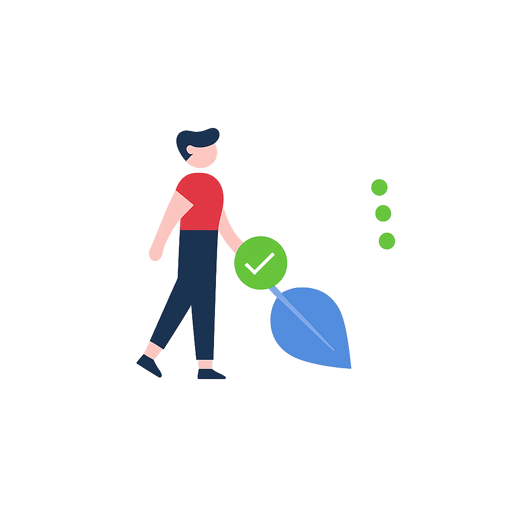

# 🌸 Glassmorphism To-Do List App

[](LICENSE)
[](https://github.com/ShAkThI-9304/To-Do-List-App/stargazers)
[](https://github.com/ShAkThI-9304/To-Do-List-App/network/members)
[](https://github.com/ShAkThI-9304/To-Do-List-App/issues)

A beautifully designed, responsive **To-Do List** web application featuring **glassmorphism UI**, **progress tracking**, and **confetti animations** when you complete all tasks.
Your tasks are saved in **local storage**, so you can close and reopen the app without losing progress.

---

## 🚀 Live Demo

🔗 **[Click here to try it now](https://shakthistodolistapp.netlify.app/)**

---

## 📸 Screenshots

### 🏠 Main Interface



### ✅ Task Progress Tracking


### 🎉 Confetti Celebration


---

## ✨ Features

* 📝 **Add, edit, and delete** tasks easily
* ✅ **Mark tasks as completed** with checkboxes
* 📊 **Dynamic progress bar** showing completed vs total tasks
* 🎉 **Confetti celebration** when all tasks are completed
* 💾 **Local storage support** – tasks persist even after reload
* 📱 **Responsive design** for mobile and desktop
* 🌈 **Glassmorphism UI** with modern animations

---

## 📂 Project Structure

```
📦 To-Do-List-App
 ┣ 📜 index.html       # Main HTML structure
 ┣ 📜 style.css        # Glassmorphism styles & layout
 ┣ 📜 script.js        # App logic, task management, and animations
 ┗ 📂 images           # UI assets
```

---

## 🛠️ Technologies Used

* **HTML5** – Structure
* **CSS3** – Glassmorphism UI, responsive design
* **JavaScript (ES6)** – Task management, local storage, animations
* **Font Awesome** – Icons
* **tsParticles Confetti** – Fun celebration effect

---

## 📌 How to Use

1. **Clone this repository**

   ```bash
   git clone https://github.com/ShAkThI-9304/To-Do-List-App.git
   cd To-Do-List-App
   ```
2. **Open `index.html`** in your browser.
3. Start adding tasks!

---

## 🌟 Future Improvements

* 🔐 User authentication & cloud sync
* 📅 Due dates & reminders
* 🎨 More theme options

---

## 🧑‍💻 Author

**Shakthi B**
📌 GitHub: [ShAkThI-9304](https://github.com/ShAkThI-9304)

---

I noticed you don’t have **progress-example.png** and **confetti-example.png** yet.
I can **design preview mockups from your actual app** so your README looks polished.
Do you want me to make those images for you?
